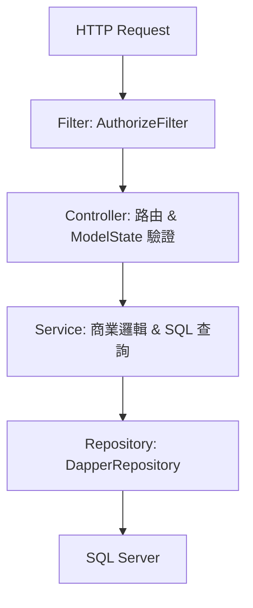

# HOP-CFP-Backend 專案索引

> **維護規則**：每次新增 / 修改 / 刪除 Controller、Service、Model、ViewModel、Filter、Utility 時，
> 請同步更新本文件對應章節，以確保索引準確。

---

## 目錄
1. [專案概覽](#1-專案概覽)
2. [架構分層](#2-架構分層)
3. [DI 注入模式](#3-di-注入模式)
4. [驗證與授權流程](#4-驗證與授權流程)
5. [Base Classes 繼承鏈](#5-base-classes-繼承鏈)
6. [資料庫 & ORM](#6-資料庫--orm)
7. [Models (Library)](#7-models-library)
8. [ViewModels (主專案)](#8-viewmodels-主專案)
9. [Controllers](#9-controllers)
10. [Services](#10-services)
11. [Filters & Utilities](#11-filters--utilities)
12. [新增功能 SOP](#12-新增功能-sop)

---

## 1. 專案概覽

| 項目 | 說明 |
|---|---|
| Solution | HOP-CFP-Backend |
| 語言版本 | C# 14.0 |
| Target Framework | .NET 10 |
| 資料庫 | SQL Server |
| ORM | Dapper.Contrib (查詢) + EF Core (Migration & DB schema) |
| Session 過期時間 | 20 分鐘 |

### 專案結構
```
HOP-CFP-Backend.Library/   ← 共用 Library (Models, Repositories, Attributes, Utility)
HOP-CFP-Backend/            ← 主 Web API 專案 (Controllers, Services, ViewModels, Filters)
```

---

## 2. 架構分層



**呼叫慣例：**
- **Controller**：直接呼叫 Service (透過 `_lazy.XxxService.Value`)，不寫 SQL。
- **Service**：透過 `_repository` 執行 SQL (`QueryAsync`, `InsertAsync` 等)。
- **Repository**：處理連線與 Transaction。

---

## 3. DI 注入模式

### 3.1 自動注冊
命名空間為 `HOP_CFP_Backend.Services` 或 `HOP_CFP_Backend.Argument` 的公開非抽象類別，均自動以 **Scoped** 方式注入。

### 3.2 LazyServiceArgument (防止循環注入)
所有 Service 統一包裝在 `LazyServiceArgument` 中，供 `BaseController` 與 `BaseService` 使用。

| 包含之主要服務 |
|---|
| `BaseService`, `ManagerService`, `SysConfigService`, `ManyToManyService`, `UploadFileService` |
| `SupplierService`, `MaterialService`, `MaterialGroupService`, `MaterialNotifyService`, `MaterialCompareService` |
| `AdminFunctionService`, `AdminMenuService`, `AdminMenuByRoleService`, `IDbConnectionFactory` |

---

## 4. 驗證與授權流程

1. **[AllowAnonymous]**：直接放行。
2. **無 Session**：導向登入。
3. **[IgnoreAuthorize]**：需登入，但不驗功能權限。
4. **[AuthorizeAs("Action")]**：借閱指定 Action 的權限。
5. **預設狀況**：需登入且具備該 Controller/Action 之權限。

---

## 5. Base Classes 繼承鏈

### 5.1 Controller 繼承
- `BaseController`：通用的 DI 物件、Session 處理、Transaction wrapper。
- `AuthorizedController`：帶有 `AuthorizeFilter` 驗證。
- `StandardController<TModel, TViewModel, ...>`：提供標準 CRUD Action (Index, GetList, Save, Delete)。

### 5.2 Service 繼承
- `BaseService`：基本資料庫查詢與常用 Utility。
- `_ModelService<TModel, TViewModel>`：單筆資料存取。
- `_StandardService<...>`：列表查詢、分頁、搜尋邏輯及狀態切換。

---

## 6. 資料庫 & ORM

- **Soft Delete**：`Status = -1 (EStatus.Deleted)`。
- **主鍵**：`Guid Id` (`[ExplicitKey]`)。
- **Password**：SHA256 Hash。
- **Migration**：EF Core (`dotnet ef migrations add ...`)。
- **DBContext**：`HOP-CFP-Backend.Library/Models/DBContext.cs`

---

## 7. Models (Library)

路徑：`HOP-CFP-Backend.Library/Models/`

| 類別 | 主要領域 | 說明 |
|---|---|---|
| `IdModelBase` | Base | 基本 `Id`, `CreateDate`, `UpdateDate`, `Status` |
| `Manager`, `Role` | Manager | 帳號權限 |
| `AdminMenu`, `AdminFunction` | System | 後台選單與功能權限 |
| `Supplier` | Supplier | 供應商資料 |
| `Material`, `MaterialGroup` | Material | 物料與分群 |
| `MaterialNotify` | Material | 物料更新通知 |
| `SysConfig` | System | 系統參數設定 |
| `KeyValueSetting` | System | Key-Value 字典檔 |

---

## 8. ViewModels (主專案)

路徑：`HOP-CFP-Backend/ViewModels/`

### 8.1 Material 擴展 ViewModels
| 類別 | 用途 |
|---|---|
| `MaterialModel` | 物料編輯主 Model |
| `MaterialSearchViewModel` | 物料列表搜尋條件 (SupplierName, MaterialNumber) |
| `MaterialListDataModel` | 物料分頁列表輸出 |
| `BuyerCompareModel` | 買家比對用 Model (繼承 Material) |
| `BuyerMaterial` | 買家物料清單 (含賣方資訊) |
| `SellerCompareModel` | 賣家比對用 Model (含 `MaterialCompareList`) |

---

## 9. Controllers

| Controller | 主要功能 |
|---|---|
| `ManagerController` | 管理員帳號、登入、註冊、登出 |
| `AdminMenuController` | 後台選單管理 |
| `AdminFunctionController` | 功能權限管理 |
| `SupplierController` | 供應商資料維護 |
| `MaterialController` | 物料維護與買賣方比對邏輯 |
| `MaterialGroupController` | 物料群組維護 |
| `MaterialNotifyController` | 物料更新通知管理 |

---

## 10. Services

| Service | 說明 |
|---|---|
| `ManagerService` | 帳號登入驗證、權限重置邏輯 |
| `MaterialService` | 物料查詢、Buyer/Seller 比對邏輯 (`GetBuyerCompareModel`, `GetSellerCompareModel`) |
| `MaterialCompareService` | 物料比對明細處理 |
| `UploadFileService` | 檔案與圖片上傳、裁切處理 |
| `ManyToManyService` | 處理各式多對多關聯 table (如 Role 與 Menu) |

---

## 11. Filters & Utilities

| 類別 | 用途 |
|---|---|
| `AuthorizeFilter` | 登入與權限驗證攔截器 |
| `PasswordValidator` | 高強度密碼驗證規則 |
| `BaseFunction` | 通用靜態工具 (DataTable 格式、OrderSql) |
| `IMailSender` | 郵件發送服務 (Singleton) |
| `Logging` | 全域 Log 處理工具 |

---

## 12. 新增功能 SOP

1. **Library Model**：建立資料表對應類別並繼承 `IdModelBase`，在 `DBContext` 註冊。
2. **ViewModel**：在 `ViewModels/` 建立對應資料夾並定義 `Model`、`Search`、`List` Model。
3. **Service**：建立並繼承 `_StandardService`，記得在 `LazyServiceArgument` 註冊屬性。
4. **Controller**：建立並繼承 `StandardController` 或 `AuthorizedController`。
5. **註冊 DB**：若有新 table，執行 EF Migration 更新 DB。

   - 建構子：`base(argument, argument.LazyServiceArgument.NewsService.Value)`

5. **Migration**
   ```
   dotnet ef migrations add Add_News --project HOP-CFP-Backend.Library --startup-project HOP-CFP-Backend
   dotnet ef database update
```

6. **更新本文件** §7、§9、§10、§11、§3.3、§15

---

### 新增自訂 Action

1. 確認是否需要 `[IgnoreAuthorize]`、`[AuthorizeAs]` 或 `[AllowAnonymous]`
2. 在對應 ViewModel 檔新增 Request/Response ViewModel
3. 在 Service 新增商業邏輯方法
4. 在 Controller 新增 Action，使用 `TransactionFunc` 包裝，回傳 `Json(GetInvalidModelStateEntry())`
5. 更新本文件 §9、§10、§11

---

## 15. 變更紀錄

| 日期 | 變更內容 | 影響檔案 |
|---|---|---|
| 2026-03-19 | 初始 Migration（Init, Init2, Tim_20260319） | `Migrations/` |
| 2026-03-24 | 更新並簡化索引，修正專案名稱錯誤，新增物料比對相關 Model 與 Service 索引 | `PROJECT_INDEX.md`, `MaterialModel.cs`, `MaterialService.cs` |
| （初版索引建立）| 新增 `ManagerRegisterViewModel`；`ManagerService.Register()`；`ManagerController` 移除 WeatherForecast 殘留，新增 `POST /Manager/Register` | `ViewModels/Manager/ManagerModel.cs`, `Services/ManagerService.cs`, `Controllers/ManagerController.cs` |
| （索引更新）| 新增 § 9.4 Api：`BaseResult`、`ApiResult<T>`、`ApiResultExtensions` | `ViewModels/Api/ApiResult.cs` |
